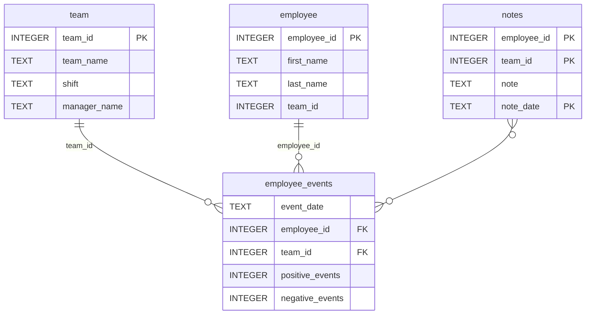

# Employee & Team Performance Dashboard

## Software Engineering for Data Scientists

This project is an interactive **Employee and Team Performance Dashboard** built with **Python**, **FastHTML**, **SQLite**, **Matplotlib**, and a custom installable Python package.

The dashboard allows managers and data teams to monitor productivity indicators, review employee or team events, visualize performance trends, and display an estimated recruitment risk generated by a machine learning model.

This project was developed as part of the **Software Engineering for Data Scientists** final project.

---

## Table of Contents

- [Project Overview](#project-overview)
- [Business Scenario](#business-scenario)
- [Main Features](#main-features)
- [Technology Stack](#technology-stack)
- [Repository Structure](#repository-structure)
- [Database Schema](#database-schema)
- [Python Package](#python-package)
- [Object-Oriented Design](#object-oriented-design)
- [Dashboard Components](#dashboard-components)
- [Machine Learning Integration](#machine-learning-integration)
- [Dashboard Visualizations](#dashboard-visualizations)
- [Installation](#installation)
- [Running the Dashboard](#running-the-dashboard)
- [Running Tests](#running-tests)
- [Building the Python Package](#building-the-python-package)
- [GitHub Actions](#github-actions)
- [Screenshots](#screenshots)
- [Project Validation Checklist](#project-validation-checklist)
- [Requirements](#requirements)
- [Notes About Local Development](#notes-about-local-development)
- [Future Improvements](#future-improvements)
- [Author](#author)
- [License](#license)

---

## Project Overview

The goal of this project is to build a simple but functional web dashboard that helps managers supervise:

- Individual employee productivity.
- Team-level productivity.
- Positive and negative employee events.
- Operational notes.
- Estimated recruitment probability.

The project combines software engineering practices with data science workflows. It includes a custom Python package for querying a SQLite database, automated tests, a FastHTML dashboard, and machine learning model integration.

---

## Business Scenario

A manufacturing company is concerned that its top employees may be recruited by competitors.

To support management decisions, the data team built a system where managers can record positive and negative employee performance events. These records are stored in a SQLite database named:

```text
employee_events.db
```

A machine learning model was also trained to estimate the probability that an employee may be recruited by another company.

This dashboard uses that database and model to provide a clear interface for monitoring employee and team performance.

---

## Main Features

The dashboard provides the following functionality:

- View productivity data for a single employee.
- View productivity data for a team.
- Select employees from a dropdown.
- Select teams from a dropdown.
- Display aggregated positive and negative event counts.
- Display operational notes.
- Show estimated recruitment probability.
- Visualize event trends over time.
- Compare total positive and negative events.
- Use reusable object-oriented dashboard components.
- Use a custom Python package for database access.
- Validate database structure using automated tests.

---

## Technology Stack

| Technology | Purpose |
|---|---|
| Python | Main programming language |
| SQLite | Local relational database |
| Pandas | Data manipulation and SQL result handling |
| Matplotlib | Dashboard visualizations |
| FastHTML | Web dashboard framework |
| Scikit-learn | Machine learning model loading and prediction |
| Pytest | Automated testing |
| Git | Version control |
| GitHub | Remote repository hosting |
| Python Build | Package distribution generation |

---

## Repository Structure

```text
├── README.md
├── assets
│   ├── model.pkl
│   └── report.css
├── python-package
│   ├── dist
│   │   ├── employee_events-0.0-py3-none-any.whl
│   │   └── employee_events-0.0.tar.gz
│   ├── employee_events
│   │   ├── __init__.py
│   │   ├── employee.py
│   │   ├── employee_events.db
│   │   ├── query_base.py
│   │   ├── requirements.txt
│   │   ├── sql_execution.py
│   │   └── team.py
│   ├── requirements.txt
│   └── setup.py
├── report
│   ├── base_components
│   │   ├── __init__.py
│   │   ├── base_component.py
│   │   ├── data_table.py
│   │   ├── dropdown.py
│   │   ├── matplotlib_viz.py
│   │   └── radio.py
│   ├── combined_components
│   │   ├── __init__.py
│   │   ├── combined_component.py
│   │   └── form_group.py
│   ├── dashboard.py
│   └── utils.py
├── src
│   ├── build_project_assets.py
│   ├── crawl.yml
│   ├── generated_data
│   │   ├── employees.json
│   │   ├── managers.json
│   │   ├── shifts.json
│   │   └── team_names.json
│   └── utils.py
├── tests
│   └── test_employee_events.py
├── requirements.txt
├── CODEOWNERS
├── LICENSE.txt
└── .gitignore
```

---

## Database Schema

The project uses a SQLite database located at:

```text
python-package/employee_events/employee_events.db
```

The database contains four main tables:

- `employee`
- `team`
- `employee_events`
- `notes`

### Entity Relationship Diagram



---

## Python Package

The project includes a custom Python package named:

```text
employee_events
```

The package is located inside:

```text
python-package/employee_events
```

It provides reusable classes to query the SQLite database and return business-critical datasets.

### Main Package Files

| File | Purpose |
|---|---|
| `sql_execution.py` | Defines the SQL execution mixin |
| `query_base.py` | Defines shared SQL queries |
| `employee.py` | Defines employee-specific queries |
| `team.py` | Defines team-specific queries |
| `__init__.py` | Exposes package classes |

---

## Object-Oriented Design

The package and dashboard use object-oriented programming principles.

### SQL Mixin

The `SQLExecutionMixin` class manages:

- Opening a SQLite connection.
- Executing SQL queries.
- Returning results as Pandas DataFrames.
- Closing the database connection.

Example responsibility:

```python
class SQLExecutionMixin:
    def query(self, sql, params=None):
        ...
```

### Query Inheritance

The `Employee` and `Team` classes inherit from `QueryBase`.

```python
class Employee(QueryBase):
    name = "employee"
```

```python
class Team(QueryBase):
    name = "team"
```

This avoids redundant SQL execution logic and keeps employee-level and team-level logic separated.

---

## Dashboard Components

The dashboard is built using reusable component classes.

### Base Components

The `report/base_components` directory contains reusable FastHTML components:

| Component | Responsibility |
|---|---|
| `BaseComponent` | Base interface for dashboard components |
| `Dropdown` | Builds dropdown selectors |
| `Radio` | Builds radio input controls |
| `DataTable` | Builds HTML tables from DataFrames |
| `MatplotlibViz` | Converts Matplotlib charts into FastHTML images |

### Combined Components

The `report/combined_components` directory contains components for grouping multiple dashboard elements.

| Component | Responsibility |
|---|---|
| `CombinedComponent` | Builds containers from child components |
| `FormGroup` | Builds form groups with buttons |

### Dashboard-Specific Components

The dashboard defines custom subclasses such as:

- `EmployeeDropdown`
- `TeamDropdown`
- `SummaryTable`
- `NotesTable`
- `RecruitmentRiskCard`
- `EventTrendChart`
- `EventBarChart`
- `DashboardPage`

These classes extend the provided base components and customize them for the project requirements.

---

## Machine Learning Integration

The dashboard loads a trained machine learning model from:

```text
assets/model.pkl
```

The model is loaded in:

```text
report/utils.py
```

using the function:

```python
def load_model():
    ...
```

The dashboard uses the selected employee or team event data as model input and displays the estimated recruitment probability.

The recruitment probability is shown in the dashboard as a business-facing metric.

---

## Dashboard Visualizations

The dashboard includes two main visualizations.

### 1. Event Trend Chart

The event trend chart displays positive and negative events over time.

It helps users identify:

- Changes in employee or team performance.
- Positive event patterns.
- Negative event patterns.
- Time-based productivity trends.

### 2. Event Comparison Chart

The event comparison chart compares total positive and negative events.

It helps users quickly understand whether the selected employee or team has more positive or negative recorded events.

---

## Installation

### 1. Clone the Repository

```bash
git clone https://github.com/pepeluseo/dsnd-dashboard-project.git
```

### 2. Enter the Project Directory

```bash
cd dsnd-dashboard-project
```

### 3. Create a Virtual Environment

```bash
python -m venv .venv
```

### 4. Activate the Virtual Environment

#### Windows PowerShell

```bash
.\.venv\Scripts\Activate.ps1
```

#### macOS/Linux

```bash
source .venv/bin/activate
```

### 5. Install Project Dependencies

```bash
python -m pip install -r requirements.txt
```

### 6. Install the Python Package in Editable Mode

```bash
python -m pip install -e python-package
```

---

## Running the Dashboard

From the project root, run:

```bash
python report/dashboard.py
```

The dashboard will start locally.

Open the following URL in a browser:

```text
http://localhost:5001
```

Example routes:

```text
http://localhost:5001/
http://localhost:5001/employee?entity_id=1
http://localhost:5001/team?entity_id=1
```

---

## Running Tests

The project includes automated tests using `pytest`.

Run all tests with:

```bash
pytest
```

Or run the database tests directly:

```bash
pytest tests/test_employee_events.py
```

Expected result:

```text
5 passed
```

### Tests Included

| Test | Purpose |
|---|---|
| `db_path` | Provides the SQLite database path |
| `test_db_exists` | Validates that the database file exists |
| `test_employee_table_exists` | Validates that the employee table exists |
| `test_team_table_exists` | Validates that the team table exists |
| `test_employee_events_table_exists` | Validates that the employee_events table exists |
| `test_notes_table_exists` | Validates that the notes table exists |

---

## Building the Python Package

The package can be built using:

```bash
cd python-package
python -m build
```

This generates distribution files in:

```text
python-package/dist/
```

Expected artifacts:

```text
employee_events-0.0.tar.gz
employee_events-0.0-py3-none-any.whl
```

The `.tar.gz` file is required for the project rubric.

---

## GitHub Actions

The repository includes GitHub Actions workflows in:

```text
.github/workflows/
```

These workflows are intended to support automated checks such as:

- Running tests.
- Running linting checks.

Workflow files included:

```text
.github/workflows/test.yml
.github/workflows/lint.yml
```

---

## Screenshots

If screenshots are added to the repository, they can be stored in an `images` directory.

Suggested screenshot paths:

```text
images/dashboard_overview.png
images/event_trend_chart.png
images/event_bar_chart.png
images/pytest_results.png
```

Example Markdown references:

```markdown


```

---

## Project Validation Checklist

The project satisfies the main rubric requirements.

### Python Package

- [x] Python package exists.
- [x] Package can be installed in the project environment.
- [x] Package opens a SQLite database connection.
- [x] Package executes SQL queries successfully.
- [x] Package is imported from `dashboard.py`.
- [x] Distribution file exists in `python-package/dist/`.

### Object-Oriented Programming

- [x] Python classes are defined without errors.
- [x] Classes can be initialized without errors.
- [x] Inheritance is used to avoid redundant code.
- [x] A SQL mixin is defined.
- [x] The mixin is used only where SQL execution is needed.
- [x] Dashboard components extend predefined base classes.

### Dashboard Development

- [x] `dashboard.py` runs without errors.
- [x] Dashboard displays data from `employee_events.db`.
- [x] Dashboard includes employee-level views.
- [x] Dashboard includes team-level views.
- [x] Dashboard includes two visualizations.
- [x] Dashboard displays recruitment risk estimation.

### Testing

- [x] Pytest tests are implemented.
- [x] Database file existence is tested.
- [x] Required database tables are tested.
- [x] Tests pass successfully.

### GitHub Repository

- [x] Project code is version controlled.
- [x] Project is pushed to GitHub.
- [x] Required package, dashboard, test, and asset files are included.
- [x] Project dependencies are listed in `requirements.txt`.
- [x] GitHub Actions workflow files are included.

---

## Requirements

The project dependencies are listed in:

```text
requirements.txt
```

Main dependencies include:

```text
scikit-learn
python-fasthtml
matplotlib
scipy
numpy
pandas
pytest
flake8
ipython
sqlite-minutils
fastcore
starlette
build
```

---

## Notes About Local Development

This project was developed and tested locally using:

- Windows PowerShell
- VS Code
- Python virtual environment
- SQLite database
- Local FastHTML server

The dashboard can be run locally after installing the required dependencies and the custom Python package.

---

## Future Improvements

Possible future enhancements include:

- Add authentication for manager-specific access.
- Improve dashboard layout and styling.
- Add more advanced employee and team KPIs.
- Add model explainability for recruitment risk.
- Add more robust error handling.
- Add API endpoints for external data access.
- Add interactive filters for date ranges.
- Add dashboard deployment instructions.
- Add screenshots to improve portfolio presentation.
- Add additional tests for SQL query outputs.

---

## Author

**Jose Luis Lazaro Contreras**

Data Science | Python | Machine Learning | Dashboard Development | QA Automation

---

## License

This project is based on starter code provided for the Udacity Software Engineering for Data Scientists project.

See `LICENSE.txt` for license details.
